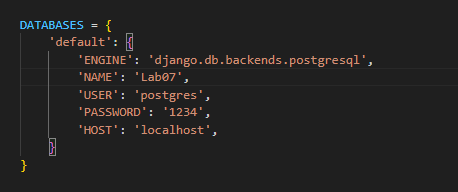
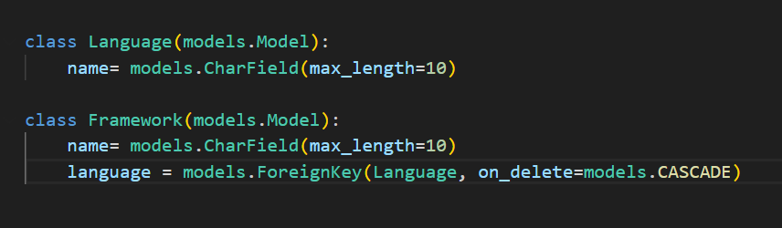
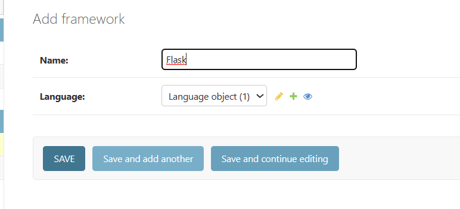
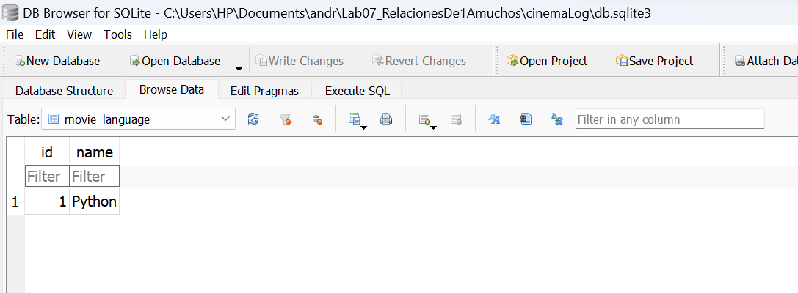
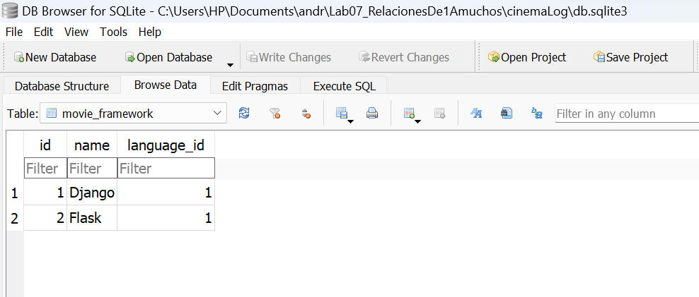
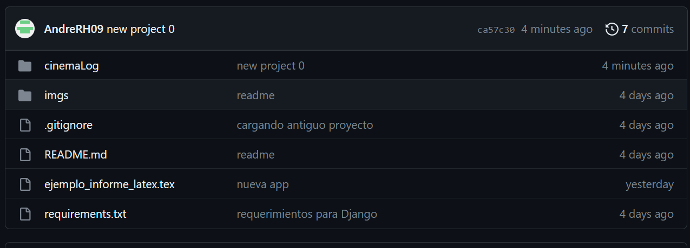
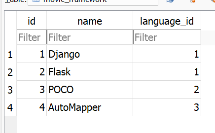
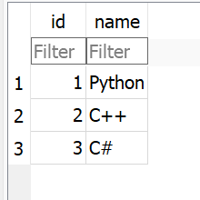
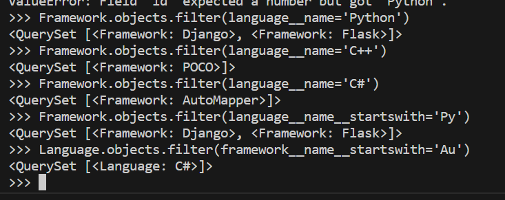

<table width="1000px">
    <theader>
        <tr>
            <td></td>
            <th>
                UNIVERSIDAD NACIONAL DE SAN AGUSTIN 
                FACULTAD DE INGENIERÍA DE PRODUCCIÓN Y SERVICIOS 
                DEPARTAMENTO ACADÉMICO DE INGENIERÍA DE SISTEMAS E INFORMÁTICA 
                ESCUELA PROFESIONAL DE INGENIERÍA DE SISTEMAS
            </th>
            <td></td>
        </tr>
    </theader>
    <tbody>
        <tr><td colspan="3">Formato: Guía de Práctica de Laboratorio</td></tr>
        <tr><td>Aprobación:  2022/03/01</td><td>Código: GUIA-PRLD-001</td><td>Página: 1</td></tr>
    </tbody>
</table>

    INFORME DE LABORATORIO 

    <table width="1000px">
        <theader>
            <tr><th colspan="6">INFORMACIÓN BÁSICA</th></tr>
        </theader>
        <tbody>
            <tr><td>ASIGNATURA:</td><td colspan="5">Programación Web 02</td></tr>
            <tr><td>TÍTULO DE LA PRÁCTICA:</td><td colspan="5">Relaciones de uno a muchos, muchos a muchos y impresion de pdf y emails</td></tr>
            <tr><td>NÚMERO DE PRÁCTICA:</td><td>07</td><td>AÑO LECTIVO:</td><td>2023 A</td><td>NRO. SEMESTRE:</td><td width="60px">  III  </td></tr>
            <tr><td>FECHA DE PRESENTACIÓN:</td><td>19-Julio-2023</td><td>HORA DE PRESENTACIÓN:</td><td colspan="3">11:00</td></tr>
            <tr>
              <td colspan="4">NOMBRE:
                <ul>
            	    <li>Añazco Huamanquispe, Andre Renzo</li>
                </ul>
              </td>
              <td>NOTA:</td><td></td>
            </tr>
            <tr>
              <td colspan="6" width="1000px">DOCENTES:
                <ul>
        	        <li>Anibal Sardon Paniagua</li>
                </ul>
              </td>
            </tr>
        </tbody>
    </table>

# Relaciones de uno a muchos, muchos a muchos y impresion de pdf y emails

[![License][license]][license-file]
[![Downloads][downloads]][releases]
[![Last Commit][last-commit]][releases]

[![Debian][Debian]][debian-site]
[![Git][Git]][git-site]
[![GitHub][GitHub]][github-site]
[![Vim][Vim]][vim-site]
[![Java][Java]][java-site]

## OBJETIVOS TEMAS Y COMPETENCIAS

### OBJETIVOS

- **Implementar** una aplicación en Django utilizando una plantilla profesional.
- Utilizar una tabla de Destinos turísticos para leer y completar la página web.
- Utilizar los tags “if” y “for” en los archivos html para leer todos los registros de una tabla desde una base de datos.

### TEMAS

- Relacion de uno a muchos
- relacion de muchos a uno
- Impresion de PDFs
- Envio de emails

COMPETENCIAS

- C.c Diseña responsablemente sistemas, componentes o procesos para satisfacer necesidades dentro de restricciones realistas: económicas, medio ambientales, sociales, políticas, éticas, de salud, de seguridad, manufacturación y sostenibilidad.
- C.m Construye responsablemente soluciones siguiendo un proceso adecuado llevando a cabo las pruebas ajustada a los recursos disponibles del cliente.
- C.p Aplica de forma flexible técnicas, métodos, principios, normas, estándares y herramientas de ingeniería necesarias para la construcción de software e implementación de sistemas de información.

## CONTENIDO DE LA GUÍA

## Actividades

- Reproducir las actividades de los videos donde trabajamos:
1. Relación de uno a muchos
2. Relación muchos a muchos
3. Impresión de pdfs 
4. Envio de emails

# Desarrollo de los videos

- Se inicia cambiando la base de datos para no interferir o tener conflictos con el proyecto anterior

## Relacion 1 a muchos

- Como se explica en el video, la interelacion entre tablas es necesario para un proyecto. De esta forma se puede trabajar con la base de datos relativamente relacionada.
- Se crean 2 modelos, para que formen parte de la tabla en la base de datos Language/framework
- Se establece la relacion 1 a muchos entre lenguaje y framework
- Se Agrega desde el admin site (tambien es posible agregarlo desde el shell de python)

- Se evidencia los commits hasta este paso

### Query Relacion 1 a muchos

- Se realizo un filtrado con distintos parametros para probar la funcionalidad de la base de datos.

- Se evidencia los commits hasta este paso

## REFERENCIAS

- https://www.w3schools.com/python/python_reference.asp
- https://docs.python.org/3/tutorial/

#

[license]: https://img.shields.io/github/license/rescobedoq/pw2?label=rescobedoq
[license-file]: https://github.com/rescobedoq/pw2/blob/main/LICENSE
[downloads]: https://img.shields.io/github/downloads/rescobedoq/pw2/total?label=Downloads
[releases]: https://github.com/rescobedoq/pw2/releases/
[last-commit]: https://img.shields.io/github/last-commit/rescobedoq/pw2?label=Last%20Commit
[Debian]: https://img.shields.io/badge/Debian-D70A53?style=for-the-badge&logo=debian&logoColor=white
[debian-site]: https://www.debian.org/index.es.html
[Git]: https://img.shields.io/badge/git-%23F05033.svg?style=for-the-badge&logo=git&logoColor=white
[git-site]: https://git-scm.com/
[GitHub]: https://img.shields.io/badge/github-%23121011.svg?style=for-the-badge&logo=github&logoColor=white
[github-site]: https://github.com/
[Vim]: https://img.shields.io/badge/VIM-%2311AB00.svg?style=for-the-badge&logo=vim&logoColor=white
[vim-site]: https://www.vim.org/
[Java]: https://img.shields.io/badge/java-%23ED8B00.svg?style=for-the-badge&logo=java&logoColor=white
[java-site]: https://docs.oracle.com/javase/tutorial/

[![Debian][Debian]][debian-site]
[![Git][Git]][git-site]
[![GitHub][GitHub]][github-site]
[![Vim][Vim]][vim-site]
[![Java][Java]][java-site]

[![License][license]][license-file]
[![Downloads][downloads]][releases]
[![Last Commit][last-commit]][releases]
